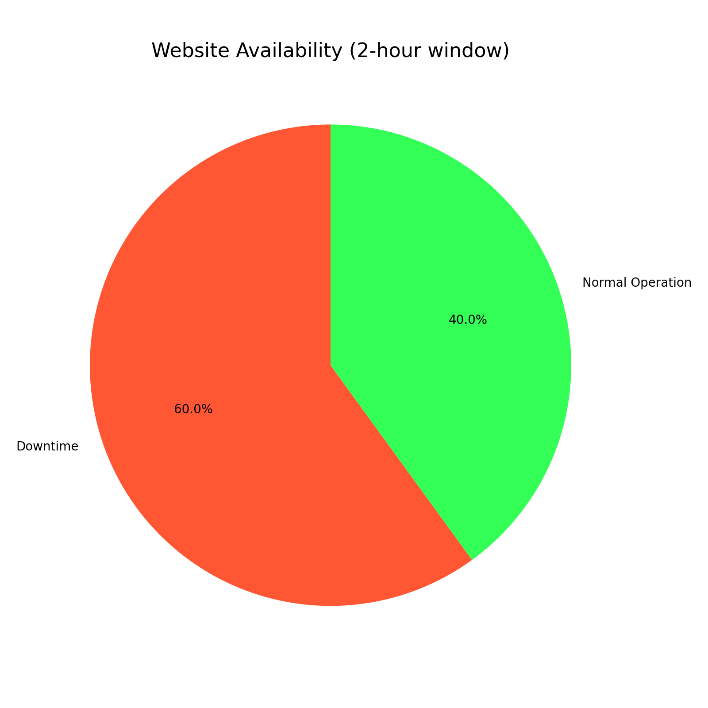
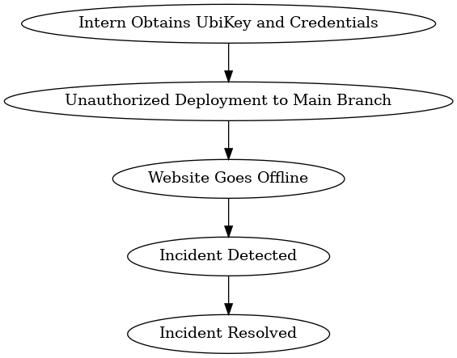
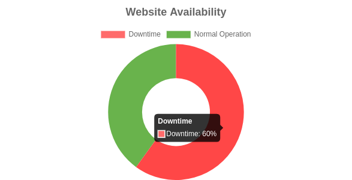

# 0x19-postmortem
## POST - Mortem

### Incident Report: Unauthorized Deployment and Website Outage - JopMed.co.ke

**Date of Incident**: August 12, 2024  
**Reported By**: Steve Murimi  
**Affected System**: `JopMed.co.ke` (Production Website)

**Overview**
On August 12, 2024, **JopMed.co.ke** experienced an unauthorized deployment directly to the main branch of the GitHub repository, which resulted in the website going offline for approximately one hour. The incident was triggered by an intern who bypassed standard procedures and pushed untested changes directly to the production environment. This unauthorized access was facilitated by the intern obtaining the UbiKey and credentials from the head security manager, which allowed them to override the main branch protection settings.

**Incident Timeline**
- **10:00 AM EAT:** Intern obtained the UbiKey and credentials from the head security manager.
- **10:15 AM EAT:** Unauthorized changes were committed and pushed directly to the main branch of the GitHub repository.
- **10:17 AM EAT:** CI/CD pipeline initiated the deployment process for the changes.
- **10:20 AM EAT:** The deployment was completed, and the website went offline immediately.
- **11:20 AM EAT:** The incident was identified, and the website was restored after a rollback to the previous stable state.

**Root Cause Analysis**
The root cause of the incident was the failure to adhere to established deployment procedures, which include:

- Branch Protection Violated:
The main branch is protected to prevent unauthorized changes. However, this protection was circumvented due to the intern gaining access to the UbiKey and credentials.

- Lack of Testing and Quality Assurance:
The changes were pushed directly to the main branch without undergoing the standard testing, quality assurance, and approval process.

**Detection and Investigation**
- **How the issue was detected:**
The issue was detected by the monitoring tools that flagged the website downtime and alerted the development and security teams.

- **Misleading investigation/debugging paths:**
Initially, the team suspected a server issue or a network outage. Several hours were spent investigating these areas before identifying the unauthorized deployment as the root cause.

- **Escalation:**
The incident was escalated to the DevOps team and the head of security for immediate action and resolution.

**Impact**
- Website Downtime: JopMed.co.ke was offline for approximately one hour, resulting in potential loss of business, user trust, and SEO ranking.

- CI/CD Pipeline Disruption: The CI/CD pipeline was affected, causing delays in other scheduled deployments.
Resolution

**Resolution**

Immediate Actions Taken:

- **Rollback**: 
The website was restored by rolling back to the last stable commit.

- **Credentials Revoked**: 
The UbiKey and credentials used by the intern were immediately revoked to prevent further unauthorized access.

- **Root Cause Identification**: 
A thorough investigation was conducted to determine the sequence of events leading to the incident.

- **Long-Term Remediation Measures:**

- **Strengthened Access Control:**
Implement stricter access controls and policies to limit the distribution of critical credentials such as UbiKeys.

- **Enhanced Branch Protection:**
Update the GitHub repository settings to require additional approval steps even when using privileged credentials.

- **Improved Testing Protocols:** 
Implement mandatory automated and manual testing for all changes, regardless of perceived criticality or size, before deployment.

**- Enhanced Communication and Training:**
Provide additional training to interns and all team members on the importance of following established protocols and the potential risks of bypassing them.

**- Monitoring and Alerts:** 
Enhance monitoring tools to detect unauthorized access and unusual activity on the main branch, with alerts sent to the development and security teams.

**Preventative Measures**
- Canary Deployment: 
Adopt a canary deployment strategy where updates are first deployed to a small subset of users before a full rollout.

- Third-Party Audits: 
Conduct regular third-party security and process audits to ensure compliance with best practices.

- Incident Response Drills: 
Regularly conduct incident response drills to ensure that the team is prepared to quickly identify and mitigate issues.

**Conclusion**
This incident highlighted critical gaps in access control, communication, and adherence to deployment procedures. By implementing the outlined resolution and preventative measures, we aim to prevent similar incidents in the future and ensure the continued reliability and security of `JopMed.co.ke`.